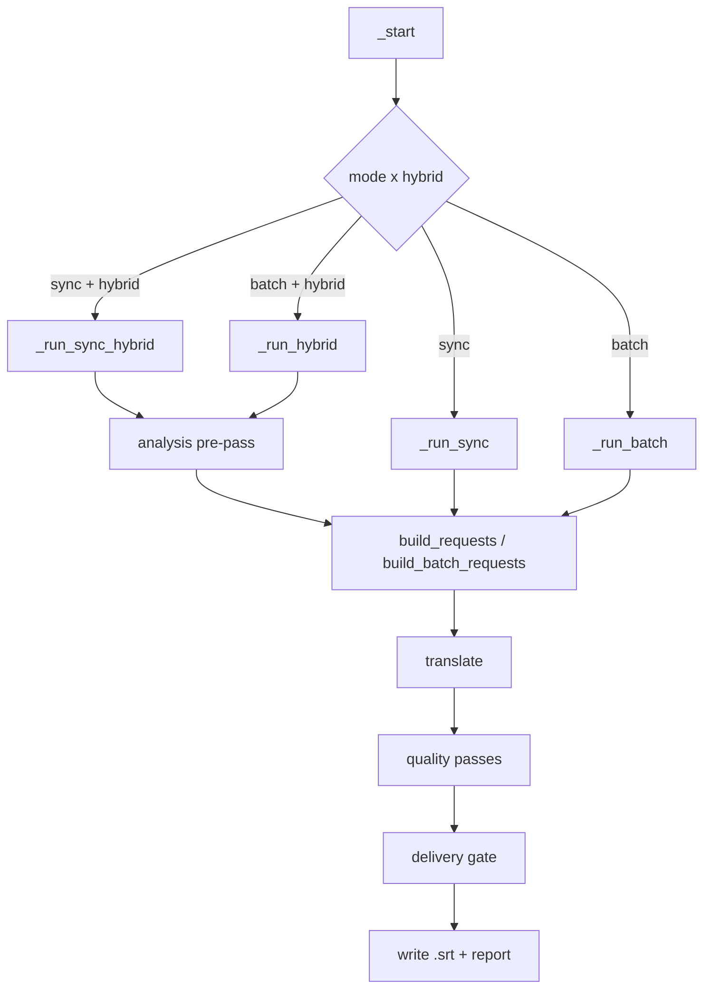

# Subtitle Translator — Architecture Overview

A Windows desktop application (CustomTkinter, English-first bilingual UI) that translates
subtitle files through the OpenAI API. Where a naive translator sends each cue
in isolation, this one spends most of its code keeping the model informed:
surrounding lines, how earlier lines were already translated, a file-level
analysis of characters and tone, genre rules, a glossary locked across a
series, and a stack of quality passes that run after the translation itself.

> **Scope note.** This file describes structure and intent. Exact thresholds,
> regexes and pass ordering live in the code and change often — read the code
> for those. This document explains how the major parts fit together.

---

## Module map

| Module | Lines | Role |
|---|---:|---|
| `subtitle_translator_gui.py` | ~48k | The application: UI, all four translation flows, quality passes, delivery gate, reporting |
| `hybrid_translate.py` | ~16k | Analysis pre-pass, prompt building, validators, quality-pass implementations |
| `provider_retry.py` | ~2.5k | Retry ladder, circuit breaker, route rotation, key fallback, response checkpoints |
| `subtitle_formats.py` | ~2k | Reading/parsing `.srt` / `.vtt` / `.ass`, encoding detection, Turkish morphology helpers |
| `sdh_cleaner.py` | ~2k | Removing sound / speaker / language labels |
| `series_memory.py` | 849 | Cross-episode canon: term and character decisions carried between episodes |
| `helper_models.py` | 816 | Resolving which model and endpoint each helper role uses (incl. Bedrock) |
| `kilavuz.py` | 741 | Source of the in-app Turkish guide; `belge_uret.py` renders `KILAVUZ.md` from it |
| `translation_memory.py` | 718 | SQLite exact + fuzzy translation memory |
| `subtitle_batch_translate.py` | 590 | Standalone CLI batch translator |
| `translation_workbench.py` | 398 | Workbench mixin: pilot launch, per-pass review entry points, approved preferences |
| `credential_store.py` | 384 | API keys in the Windows credential store, with an obfuscated-file fallback |
| `video_subtitles.py` | 370 | Extracting a subtitle track from a video file |
| `project_memory.py` | 354 | Per-folder glossary and character memory |
| `prompt_constants.py` | 353 | Shared prompt fragments, so flows cannot drift apart |
| `repair_batches.py` | 317 | CLI repair of an already-delivered batch output |
| `translation_review.py` | 242 | Per-pass diff review, scene grouping, preference persistence, apply/rollback |
| `response_integrity.py` | 201 | Validating and recovering a model response payload |
| `ui_localization.py` | 196 | English-first UI string catalog with the Turkish overlay |
| `app_state.py` | 155 | Atomic writes and cross-process locks |
| `request_cancellation.py` | 152 | Cooperative cancellation contract |
| `folder_picker.py` | 127 | Native folder-picker helper |
| `pilot_runner.py` | 76 | Pilot-mode entry: replays a run with a captured settings payload |

Tests: ~400 modules under `tests/`, plain `unittest`, no pytest.

---

## The four translation flows

`_start()` dispatches on mode × the "Yardımcı Analiz" toggle. All four live in
`subtitle_translator_gui.py` and share helpers, but **each keeps its own write,
translation-memory and report block** — which is why a change usually has to be
applied four times, and why "twin parity" is the most common bug class in this
repository.

- **`_run_sync`** — a `ThreadPoolExecutor` over chunks, one chat completion each.
- **`_run_sync_hybrid`** — the same, preceded by the analysis pre-pass. **This is
  the flow the project owner actually runs.**
- **`_run_batch` → `_wait_batch` → `_write_results`** — the OpenAI Batch API:
  half the price, asynchronous. `_resume_batches` recovers a crashed run from
  `batch_id.txt` plus `batch_fmap_<id>.json`.
- **`_run_hybrid` / `_wait_batch_hybrid`** — batch with the analysis pre-pass.

---

## What the model actually sees

This is the part worth understanding. A chunk's payload may carry:

| Key | Meaning |
|---|---|
| `ctx` | The lines immediately before this chunk |
| `next_ctx` | Read-ahead: the lines immediately after |
| `prev_scene` | A bridge across a scene cut |
| `prev_tr` | How the *earlier lines were already translated* — the chained-context feature |
| `glossary` | File, project and series terms, plus locked terms |
| `frag` | Tags marking a sentence that spans several cues |

Chunk boundaries (`_make_smart_chunks*`) prefer a scene gap, then a sentence
end, and never split a multi-line-sentence fragment group.

Two system prompts exist — `_build_sync_system_prompt` and
`ht.build_system_prompt` — and **they must stay semantically aligned**. Adding a
payload key or a rule to one without the other is a silent quality regression in
half the flows.

### Where the glossary comes from

Four sources, narrowest first: the file's own analysis, `project_memory`
(per-folder), `series_memory` (per show, carried across episodes), and the
translation memory. Each is capped before it reaches the prompt — an uncapped
hint list has repeatedly turned into a term the model was forced to use even
where it did not belong.

### Content schemas

`CONTENT_SCHEMAS` holds genre-specific rule sets (documentary, anime, tabletop
RPG, and so on). "Otomatik" detects the genre through
`detect_content_type_with_ai`, whose candidate list is derived from
`CONTENT_SCHEMAS` itself — add a schema and both detection and the UI combobox
pick it up. `_match_category` maps the model's free-text answer back to a schema.

---

## After the translation

Quality passes, each behind its own sidebar toggle, roughly in order:

consistency sweep → context review (batch only) → Critic → Polish → Native
Reader → condense → SDH clean → line breaks → QC.

Two things about them are easy to get wrong:

- **Most are report-only by default.** `quality_report_only` defaults to on, so
  a pass produces *suggestions* and does not rewrite the text. A pass that
  applies changes must record `pass_status[<name>]` with `report_only`, or the
  report will label its candidates as applied fixes.
- **Candidates are validated before they are accepted.** `validate_polish_candidate`
  and `validate_condense_candidate` reject a rewrite that drops a negation,
  swaps subject and object, deletes a content word, merges words, or regresses
  Turkish diacritics. These guards are the reason a helper model cannot quietly
  change what a line means.

Then, always, last: `_fill_hata_with_source` marks anything still untranslated,
and `_restore_tags_blocks` puts back the `<i>` and `{\an8}` markup that
`_clean_src` stripped before translation. A per-file row feeds
`build_quality_report_text` → `ceviri_raporu.txt`.

Before a file is declared delivered it passes a **delivery gate** that scans for
hard errors; in strict mode a failing file is quarantined to
`Raporlar/Kurtarma/` rather than shipped.

---

## Talking to the provider

Everything goes through `provider_retry`, not the OpenAI client directly:

- an eleven-step retry ladder, with the wait taken from `Retry-After` when the
  provider supplies one;
- a process-wide circuit breaker keyed on endpoint + key fingerprint + model, so
  one dead model does not stall the others;
- route rotation across reseller addresses, chosen per attempt;
- fallback to a second API key on authentication, quota and group errors;
- response checkpoints, so a paid response already received is not paid for twice.

Helper roles (Critic, Polish, Native, QC, condense, analysis) resolve their model
through `helper_models.resolve_helper_model`. All helper calls go through
`hybrid_translate._safe_chat_create`, which strips `temperature` and maps
`max_tokens` for gpt-5 and o-series models — calling the client directly makes
those models error.

---

## State on disk

| Path | Contents |
|---|---|
| `.gui_settings.json` | All UI state **except API keys** |
| Windows Credential Manager | The API keys (`credential_store.py`, with an obfuscated-file fallback) |
| `translation_memory.db` | SQLite exact + fuzzy translation memory |
| `.context_cache/<stem>.json` | Cached per-file analysis, invalidated by a fingerprint over model, endpoint, languages, depth, style, schema, glossary and the source file's SHA-256 |
| `.series_memory/` | Per-show canon |
| `<folder>/.project_memory.json` | Per-folder glossary and characters |
| `batch_id.txt`, `batch_fmap_<id>.json` | In-flight batch recovery |
| `logs/*.log` | Rotated at startup, keeping the newest 100; logs of a live process are never deleted |
| `Raporlar/` | Per-file quality report, source archive, raw backup, recovery and quarantine copies |

Never store a translation memory pair whose source equals its target — the
untranslated-line marker exists partly to guard that.

---

## Conventions

- Subtitle reads go through `subtitle_formats.read_subtitle_text`
  (utf-8-sig → cp1254 → latin-1, then newline normalisation). Opening a file
  directly with `encoding="utf-8-sig"` crashes on Windows-1254 Turkish files.
- Output is written atomically: build the whole file in memory, write a
  temporary file, flush, fsync, replace. A locked or full disk leaves the
  previous file intact.
- Turkish morphology lives in **one** place, `subtitle_formats`. Several bugs
  have been traced to a detector re-implementing it locally and getting it
  wrong; when a detector misses a real case, suspect the shared helper first.
- New detectors and guards are measured against the real delivery archive
  before being trusted — both the false-positive rate and the known real
  findings, in the same run.
- UI strings, log messages and comments are Turkish; identifiers are English.
  Names like `minimax_*` are legacy and now carry the OpenAI helper config.
