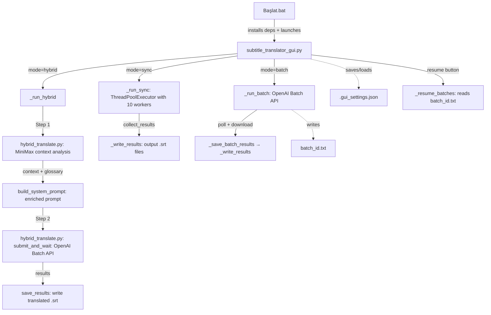
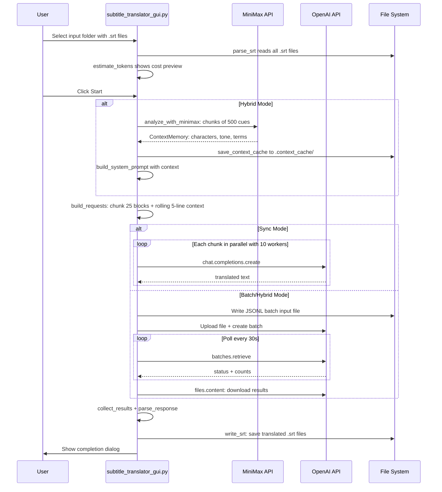

# Subtitle Batch Translator — Architecture Overview

## Project Summary

This is a **subtitle translation tool** that translates `.srt` subtitle files using OpenAI and MiniMax APIs. It provides a dark-themed GUI built with CustomTkinter and supports three translation modes. The project is written in Turkish-language UI.

---

## File Map

```
Batch/
├── Başlat.bat                    — Launcher: installs deps, starts GUI
├── subtitle_translator_gui.py    — Main GUI application (~996 lines)
├── subtitle_batch_translate.py   — Standalone CLI batch translator
├── resume_batch.py               — CLI script to resume interrupted batches
├── hybrid_translate.py           — Hybrid mode: MiniMax analysis → OpenAI batch
├── .gui_settings.json            — Persisted GUI settings (model, paths, keys)
├── batch_id.txt                  — Saved OpenAI batch IDs for resumption
└── batch_input_0.jsonl           — Generated JSONL input for OpenAI Batch API
```

---

## Architecture Diagram



---

## Component Details

### 1. `Başlat.bat` — Launcher

A Windows batch script that:
- Sets console codepage to UTF-8
- Checks if `openai` and `customtkinter` pip packages are installed; installs them if missing
- Launches [`subtitle_translator_gui.py`](subtitle_translator_gui.py)

### 2. `subtitle_translator_gui.py` — Main GUI Application

The central file of the project. A CustomTkinter desktop app with a sidebar + main panel layout.

#### UI Structure

- **Left sidebar** ([`_build_sidebar`](subtitle_translator_gui.py:162)): scrollable settings panel with sections for API key, model selection, translation mode, language pair, input/output folders, MiniMax hybrid toggle, glossary picker, and action buttons.
- **Right main area** ([`_build_main`](subtitle_translator_gui.py:394)): stats cards showing file count, block count, completed, failed, and token usage. Below that: a progress bar with ETA and a scrollable log output.

#### Three Translation Modes

1. **Sync Mode** ([`_run_sync`](subtitle_translator_gui.py:647)): Sends translation requests concurrently using `ThreadPoolExecutor` with 10 workers. Each request calls `client.chat.completions.create()` directly. Results are collected into a `raw_map` and written to `.srt` files.

2. **Batch Mode** ([`_run_batch`](subtitle_translator_gui.py:715)): Packages all subtitle blocks into a JSONL file, uploads to OpenAI Files API, creates a Batch job, and polls until completion. Supports splitting into multiple batches if over 50,000 requests. Batch IDs are saved to [`batch_id.txt`](batch_id.txt) for crash recovery.

3. **Hybrid Mode** ([`_run_hybrid`](subtitle_translator_gui.py:882)): Two-stage pipeline:
   - Stage 1: Sends subtitle cues to MiniMax API for context analysis — identifies characters, tone, recurring terms, setting, and scene notes. Results are cached in `.context_cache/` directories.
   - Stage 2: Builds an enriched system prompt with the context data, then submits to OpenAI Batch API for translation.

#### Key Helper Functions

| Function | Location | Purpose |
|----------|----------|---------|
| [`parse_srt`](subtitle_translator_gui.py:42) | Top-level | Parses `.srt` into list of `(index, timestamp, text)` tuples |
| [`write_srt`](subtitle_translator_gui.py:53) | Top-level | Writes tuples back to `.srt` format |
| [`estimate_tokens`](subtitle_translator_gui.py:59) | Top-level | Rough token estimate: chars/4 * 2 + system prompt overhead |
| [`build_requests`](subtitle_translator_gui.py:71) | Top-level | Builds OpenAI API request objects with rolling context window of 5 previous subtitle lines |
| [`parse_response`](subtitle_translator_gui.py:117) | Top-level | Parses JSON or line-by-line translation responses |
| [`collect_results`](subtitle_translator_gui.py:128) | Top-level | Maps translated results back to their source files |

#### Settings Persistence

[`_save_settings`](subtitle_translator_gui.py:547) / [`_load_settings`](subtitle_translator_gui.py:563) serialize all UI state to [`.gui_settings.json`](.gui_settings.json) including API keys, model choices, folder paths, and mode selection.

#### Chunking Strategy

Both sync and batch modes group subtitle blocks into chunks of 25 (the `CHUNK` constant at [line 37](subtitle_translator_gui.py:37)). Each chunk includes a `ctx` field with the 5 previous subtitle lines (`CONTEXT_LINES` at [line 38](subtitle_translator_gui.py:38)) to give the model continuity context.

### 3. `subtitle_batch_translate.py` — Standalone CLI Batch Translator

A command-line alternative to the GUI. It:

- Has hardcoded settings at the top (API key, languages, folders, model — defaults to `gpt-4.1-nano`)
- [`create_batch_requests`](subtitle_batch_translate.py:51): Creates one API request per subtitle block (not chunked like the GUI)
- [`submit_batch`](subtitle_batch_translate.py:86): Writes JSONL, uploads to OpenAI, creates batch
- [`wait_for_batch`](subtitle_batch_translate.py:111): Polls every 60 seconds
- [`process_results`](subtitle_batch_translate.py:129): Downloads and assembles translated `.srt` files
- Saves batch ID to [`batch_id.txt`](batch_id.txt) for recovery

**Key difference from GUI**: This script sends one request per subtitle block, while the GUI chunks 25 blocks per request with rolling context. The GUI approach is more efficient and produces better translations due to context.

### 4. `resume_batch.py` — Batch Resumption Script

A small CLI utility that:
- Reads batch IDs from [`batch_id.txt`](batch_id.txt)
- Reconstructs the file map by scanning the input folder
- Calls [`wait_for_batch`](subtitle_batch_translate.py:111) and [`process_results`](subtitle_batch_translate.py:129) from `subtitle_batch_translate`

### 5. `hybrid_translate.py` — Hybrid Translation Engine

Implements the two-stage hybrid translation pipeline used by the GUI.

#### Stage 1: MiniMax Context Analysis

- [`analyze_with_minimax`](hybrid_translate.py:105): Sends subtitle cues in chunks of 500 to MiniMax API for context analysis. Uses `ThreadPoolExecutor` with 2 workers. Returns a `ContextMemory` object with characters, tone, recurring terms, etc.
- [`_merge_memories`](hybrid_translate.py:186): Merges multiple chunk analysis results into a single `ContextMemory` by deduplicating characters, merging term dictionaries, and combining scene notes.
- Context is cached to disk via [`save_context_cache`](hybrid_translate.py:59) / [`load_context_cache`](hybrid_translate.py:77) in `.context_cache/` directories so re-translation skips the analysis step.

#### Stage 2: OpenAI Batch Translation

- [`build_system_prompt`](hybrid_translate.py:232): Builds a rich system prompt incorporating the MiniMax analysis — content summary, setting, tone, character voices, mandatory term translations, and translation rules.
- [`build_batch_requests`](hybrid_translate.py:284): Creates chunked batch requests (25 items per chunk) with JSON-formatted input/output and rolling context of 5 lines.
- [`submit_and_wait`](hybrid_translate.py:326): Uploads JSONL to OpenAI, creates batch, polls with 30-second intervals. Supports cancellation via `stop_flag_fn`.
- [`save_results`](hybrid_translate.py:392): Downloads batch output, parses JSON responses, assembles and writes the translated `.srt` file.

#### External Dependency

This module imports from an external project at `<kardes-proje-yolu>` — specifically `subtitle_localizer.srt`, `subtitle_localizer.models`, and `subtitle_localizer.minimax_client`. This is a separate project that provides the `ContextMemory`, `CharacterVoice`, `MiniMaxProvider`, and SRT parsing models.

### 6. `.gui_settings.json` — Settings Store

Auto-generated file storing the last-used GUI configuration:

```json
{
  "model": "gpt-4.1-mini",
  "src_lang": "English",
  "tgt_lang": "Turkish",
  "input": "C:/Users/T/Downloads/...",
  "output": "C:/Users/T/Downloads/Çıktı"
}
```

---

## Data Flow



---

## Key Design Patterns

1. **Rolling Context Window**: Both the GUI and hybrid mode include the previous 5 subtitle lines as `ctx` in each translation request. This gives the LLM continuity awareness without re-sending the entire file.

2. **Chunked Batching**: Subtitles are grouped into chunks of 25 blocks per API request. This balances token efficiency with translation quality — the model sees enough context to be consistent but not so much that it loses focus.

3. **Context Caching**: The hybrid mode caches MiniMax analysis results per-file in `.context_cache/`. If you re-translate the same file, the expensive MiniMax analysis step is skipped.

4. **Crash Recovery**: Batch IDs are persisted to `batch_id.txt`. The Resume button and `resume_batch.py` can pick up where a crashed session left off.

5. **JSON-Structured I/O**: The GUI and hybrid mode use structured JSON for translation input/output rather than plain text. Each subtitle block has an index `i` and text `t`. This makes parsing more reliable than free-text translation.

6. **50K Request Limit Handling**: The GUI batch mode automatically splits requests into multiple OpenAI batches if there are more than 50,000 requests, staying within API limits.
