# Subtitle Batch Translator — Detailed Implementation Plan

This plan covers all 22 improvements identified in the code review, organized into implementation phases. Each task includes concrete steps, affected files, and verification criteria.

---

## Phase 1: Security & Portability

### Task 1.1 — Secure API Key Storage

**Problem:** API keys are written in plain text to `.gui_settings.json`

**Steps:**
1. Add `keyring` to dependencies in [`Başlat.bat`](Başlat.bat) (pip install check)
2. Create a new module `credential_store.py` with functions:
   - `save_key(service, key)` — stores via keyring, falls back to encrypted file
   - `load_key(service)` — retrieves from keyring, falls back to encrypted file
   - `delete_key(service)` — removes stored credential
3. Modify [`_save_settings`](subtitle_translator_gui.py:547) to stop writing `api_key` and `minimax_key` to JSON; call `credential_store.save_key()` instead
4. Modify [`_load_settings`](subtitle_translator_gui.py:563) to call `credential_store.load_key()` instead of reading from JSON
5. Add a "Remember keys" checkbox — only store if checked
6. Clear the existing plain-text keys from `.gui_settings.json`

**Affected files:** `Başlat.bat`, `subtitle_translator_gui.py`, new `credential_store.py`

**Verification:**
- API keys no longer appear in `.gui_settings.json`
- Keys persist across app restarts
- Works on machines without keyring (graceful fallback)

---

### Task 1.2 — Remove Hardcoded External Path

**Problem:** [`SUBTITLE_PROJECT_PATH`](hybrid_translate.py:12) is hardcoded to `C:\Users\T\Desktop\PROJE\Altyazı Çevirisi`

**Steps:**
1. Add an "External Project Path" field to the GUI sidebar in the MiniMax section
2. Store the path in `.gui_settings.json` via [`_save_settings`](subtitle_translator_gui.py:547) / [`_load_settings`](subtitle_translator_gui.py:563)
3. Change [`_ensure_path`](hybrid_translate.py:16) to accept the path as a parameter instead of using the global constant
4. Thread the path through all hybrid functions: [`analyze_with_minimax`](hybrid_translate.py:105), [`load_srt`](hybrid_translate.py:23), [`save_context_cache`](hybrid_translate.py:59), [`load_context_cache`](hybrid_translate.py:77)
5. Update [`_run_hybrid`](subtitle_translator_gui.py:882) to pass the configured path to all hybrid functions
6. Add a validation check at startup: if hybrid mode is enabled and the external path is missing/invalid, show a clear error message

**Affected files:** `hybrid_translate.py`, `subtitle_translator_gui.py`

**Verification:**
- Hybrid mode works from any machine without editing source code
- Missing external path shows a user-friendly error, not a stack trace

---

## Phase 2: Code Quality

### Task 2.1 — Extract Shared SRT Utilities

**Problem:** `parse_srt` and `write_srt` are duplicated across files

**Steps:**
1. Create `srt_utils.py` with the following functions extracted:
   - `parse_srt(filepath)` — from [`subtitle_translator_gui.py:42`](subtitle_translator_gui.py:42)
   - `write_srt(filepath, blocks)` — from [`subtitle_translator_gui.py:53`](subtitle_translator_gui.py:53)
   - `estimate_tokens(srt_files, chunk_size)` — from [`subtitle_translator_gui.py:59`](subtitle_translator_gui.py:59)
2. Update `subtitle_translator_gui.py` to import from `srt_utils`
3. Update `subtitle_batch_translate.py` to import from `srt_utils` instead of defining its own versions
4. Update `resume_batch.py` to import from `srt_utils`
5. Remove the duplicate function definitions

**Affected files:** new `srt_utils.py`, `subtitle_translator_gui.py`, `subtitle_batch_translate.py`, `resume_batch.py`

**Verification:**
- No duplicate SRT parsing/writing functions remain
- All modes still produce identical output

---

### Task 2.2 — Align CLI Chunking with GUI

**Problem:** [`subtitle_batch_translate.py`](subtitle_batch_translate.py) sends one request per block; the GUI chunks 25 blocks with rolling context

**Steps:**
1. Refactor [`create_batch_requests`](subtitle_batch_translate.py:51) to use the same chunking strategy as [`build_requests`](subtitle_translator_gui.py:71)
2. Add `CHUNK_SIZE` and `CONTEXT_LINES` constants at the top of `subtitle_batch_translate.py`
3. Update the request format to use JSON input/output (matching the GUI pattern)
4. Update [`process_results`](subtitle_batch_translate.py:129) to parse JSON array responses instead of plain text
5. Add the `_strip_md` and `parse_response` logic from the GUI

**Affected files:** `subtitle_batch_translate.py`

**Verification:**
- CLI and GUI produce similar quality translations
- CLI batch size is reduced by ~25x (fewer API requests)

---

### Task 2.3 — Add Unit Tests

**Problem:** No test coverage for critical parsing and data assembly functions

**Steps:**
1. Create `tests/` directory with `__init__.py`
2. Create `tests/test_srt_utils.py`:
   - `test_parse_srt_basic` — normal SRT with multiple blocks
   - `test_parse_srt_empty` — empty file
   - `test_parse_srt_bom` — file with UTF-8 BOM
   - `test_parse_srt_multiline_text` — blocks with multi-line subtitle text
   - `test_parse_srt_missing_timestamp` — malformed blocks are skipped
   - `test_write_srt` — round-trip: parse → write → parse matches
   - `test_write_srt_creates_dirs` — output directories are created
   - `test_estimate_tokens` — reasonable token estimates
3. Create `tests/test_response_parsing.py`:
   - `test_parse_response_json` — valid JSON array response
   - `test_parse_response_markdown_wrapped` — response in ```json block
   - `test_parse_response_fallback_lines` — non-JSON response falls back to line matching
   - `test_collect_results` — results map back to correct files
4. Create `tests/conftest.py` with shared fixtures (sample SRT content, sample responses)
5. Add a `--test` option or separate `run_tests.py` script

**Affected files:** new `tests/` directory

**Verification:**
- All tests pass
- Edge cases for SRT parsing are covered

---

## Phase 3: Error Handling & Resilience

### Task 3.1 — Add Retry Logic for Failed Requests

**Problem:** Failed batch requests are only logged, never retried

**Steps:**
1. Add a `MAX_RETRIES` constant (default 3) to the GUI
2. In [`_save_batch_results`](subtitle_translator_gui.py:836), collect failed `custom_id`s separately
3. After batch results are processed, check for failures:
   - If failures exist, rebuild a new JSONL with only the failed requests
   - Re-submit as a new batch
   - Repeat up to `MAX_RETRIES` times
4. In the GUI, add a "Retry Failed" button that appears when failures are detected
5. Log each retry attempt clearly
6. For sync mode, add per-request retry with exponential backoff in [`send_one`](subtitle_translator_gui.py:673)

**Affected files:** `subtitle_translator_gui.py`

**Verification:**
- Transient API failures are automatically retried
- "Retry Failed" button appears only when there are failures
- Retry count is displayed in logs

---

### Task 3.2 — Validate File Structure on Resume

**Problem:** Resume assumes input files haven't changed since batch submission

**Steps:**
1. In [`_run_batch`](subtitle_translator_gui.py:715), save a manifest alongside `batch_id.txt` containing:
   - List of input file paths and their modification timestamps
   - Block counts per file
   - The model and language settings used
2. In [`_resume_batches`](subtitle_translator_gui.py:773), load the manifest and compare:
   - Check if all files still exist
   - Check if modification timestamps match
   - Check if block counts match
3. If discrepancies found, show a warning dialog:
   - "Some input files have changed since the batch was submitted. Results may be incorrect. Continue anyway?"
4. Add the manifest filename to the batch_id.txt format (e.g., `batch_id\tmanifest_path`)

**Affected files:** `subtitle_translator_gui.py`

**Verification:**
- Resuming after file changes shows a warning
- Resuming with unchanged files works silently

---

### Task 3.3 — Improve Error Reporting in Settings

**Problem:** [`_load_settings`](subtitle_translator_gui.py:563) silently swallows all exceptions

**Steps:**
1. Replace the bare `except Exception: pass` with specific exception handlers
2. Log a warning if settings file is corrupted
3. If JSON parsing fails, backup the corrupted file as `.gui_settings.json.bak`
4. Reset to defaults and inform the user

**Affected files:** `subtitle_translator_gui.py`

**Verification:**
- Corrupted settings file triggers a user-visible warning
- Original corrupted file is backed up, not deleted

---

## Phase 4: User Experience

### Task 4.1 — Add Log Persistence

**Problem:** Logs are lost when the app closes

**Steps:**
1. Create a `logs/` directory in the app's parent folder
2. Add a `logging.FileHandler` alongside the existing GUI log
3. Log format: `[YYYY-MM-DD HH:MM:SS] [LEVEL] message`
4. Rotate log files: one per session, named `translator_YYYYMMDD_HHMMSS.log`
5. Add a "Open Log Folder" button in the log header area
6. Keep only the last 10 log files (auto-cleanup on startup)

**Affected files:** `subtitle_translator_gui.py`

**Verification:**
- Log files appear in `logs/` after each session
- "Open Log Folder" opens the directory in Explorer

---

### Task 4.2 — Improve MiniMax Progress Display

**Problem:** MiniMax analysis shows chunk-level progress but no ETA or per-line detail

**Steps:**
1. In [`_run_hybrid`](subtitle_translator_gui.py:882), add an ETA calculation for the analysis phase (similar to the batch polling ETA)
2. Show both chunk progress and estimated total lines analyzed
3. Add a subtitle text under the progress bar: "Analyzing chunk 3/10 — ~2,500 lines processed"
4. Update [`analyze_with_minimax`](hybrid_translate.py:105) progress_fn to include cumulative line count

**Affected files:** `hybrid_translate.py`, `subtitle_translator_gui.py`

**Verification:**
- MiniMax analysis shows meaningful ETA
- Progress bar accurately reflects analysis progress

---

### Task 4.3 — Add Translation Preview

**Problem:** No way to test translation quality before committing to a full batch

**Steps:**
1. Add a "Preview" button next to "Start" in the sidebar
2. Preview mode:
   - Parses all input files
   - Selects the first 10 subtitle blocks (or first 2 blocks from each file)
   - Sends them as a single sync request
   - Displays results in a preview dialog with side-by-side original/translated text
3. Create a `PreviewDialog` class with:
   - Left column: original text
   - Right column: translated text
   - Color coding for potential issues (empty translations, very long/short results)
   - "Start Full Translation" and "Cancel" buttons
4. The preview uses the same system prompt and settings as the full run

**Affected files:** `subtitle_translator_gui.py`

**Verification:**
- Preview shows side-by-side translation of sample blocks
- Users can adjust settings before committing

---

## Phase 5: Performance

### Task 5.1 — Eliminate Redundant SRT Parsing

**Problem:** [`_run_batch`](subtitle_translator_gui.py:715) calls `parse_srt` multiple times per file

**Steps:**
1. In [`_run_batch`](subtitle_translator_gui.py:715), parse all files once into a dict: `{filepath: blocks}`
2. Pass the pre-parsed blocks to [`build_requests`](subtitle_translator_gui.py:71) instead of having it re-parse
3. Modify `build_requests` to accept pre-parsed blocks as an optional parameter
4. Use the same cache for the stats calculation (line 732)

**Affected files:** `subtitle_translator_gui.py`

**Verification:**
- Each file is parsed exactly once per run
- No change in output or behavior

---

### Task 5.2 — Incremental Result Writing

**Problem:** In sync mode, all results are collected in memory before writing to disk

**Steps:**
1. In [`_run_sync`](subtitle_translator_gui.py:647), track completion per-file instead of globally
2. When all chunks for a specific file are complete, write that file immediately
3. Add a "Files saved: X/Y" counter in the stats area
4. Free the raw_map entries for completed files to reduce memory usage

**Affected files:** `subtitle_translator_gui.py`

**Verification:**
- Translated files appear in the output folder as they complete
- Memory usage stays flat instead of growing linearly

---

## Phase 6: Features

### Task 6.1 — Multi-Language Support

**Problem:** Only one target language per run

**Steps:**
1. Replace the single language `CTkComboBox` with a multi-select widget:
   - Use `CTkScrollableFrame` with `CTkCheckBox` items for each language
2. When multiple languages are selected, create separate output subdirectories: `{output}/Turkish/`, `{output}/German/`, etc.
3. Submit separate batches per language (or a single batch with language-prefixed `custom_id`s)
4. Update the stats display to show per-language progress

**Affected files:** `subtitle_translator_gui.py`

**Verification:**
- Selecting 3 languages creates 3 output folders with translated files
- Each language uses the correct target in the system prompt

---

### Task 6.2 — Translation Memory Cache

**Problem:** Re-translating the same content wastes API credits

**Steps:**
1. Create a `translation_cache/` directory with SQLite database `cache.db`
2. Schema: `CREATE TABLE translations (source_hash TEXT, src_lang TEXT, tgt_lang TEXT, model TEXT, source_text TEXT, translated_text TEXT, timestamp DATETIME)`
3. Before sending a request, hash each subtitle block and check the cache
4. Cache hits: use stored translation, skip API call
5. Cache misses: send to API, store result in cache
6. Add a "Clear Translation Cache" button in the GUI
7. Show cache hit rate in the stats area

**Affected files:** new `translation_cache.py`, `subtitle_translator_gui.py`

**Verification:**
- Re-translating the same file shows 100% cache hit rate and zero API cost
- Cache can be cleared via the GUI

---

### Task 6.3 — Glossary Support in All Modes

**Problem:** Glossary only works in hybrid mode

**Steps:**
1. Move the glossary file picker outside the hybrid section (make it always visible)
2. In [`build_requests`](subtitle_translator_gui.py:71), if a glossary is loaded, append glossary rules to the system prompt:
   ```
   MANDATORY TERM TRANSLATIONS:
   Hello → Merhaba
   World → Dünya
   ```
3. In sync mode, apply the same prompt enrichment
4. In batch mode, apply the same prompt enrichment
5. Load glossary using [`load_glossary`](hybrid_translate.py:30) from `hybrid_translate.py` (or move to `srt_utils.py` after Task 2.1)

**Affected files:** `subtitle_translator_gui.py`

**Verification:**
- Glossary terms appear in the system prompt for all modes
- Translations respect glossary terms regardless of mode

---

## Phase 7: Configuration

### Task 7.1 — Make Constants Configurable

**Problem:** Chunk size, context lines, max workers are hardcoded

**Steps:**
1. Add an "Advanced Settings" collapsible section at the bottom of the sidebar
2. Add configurable fields:
   - Chunk size (default 25, range 5-50)
   - Context lines (default 5, range 0-20)
   - Sync max workers (default 10, range 1-50)
   - MiniMax chunk size (default 500, range 100-2000)
   - MiniMax max workers (default 2, range 1-10)
3. Persist these in `.gui_settings.json`
4. Replace hardcoded constants with variable references throughout the code

**Affected files:** `subtitle_translator_gui.py`

**Verification:**
- Changing chunk size to 10 produces smaller batch requests
- Settings persist across app restarts

---

### Task 7.2 — Dynamic Model List

**Problem:** [`MODELS`](subtitle_translator_gui.py:27) list is hardcoded

**Steps:**
1. On app startup, call `client.models.list()` to fetch available models
2. Filter to models that support chat completions
3. Populate the model dropdown dynamically
4. If API call fails, fall back to the current hardcoded list
5. Allow user to type a custom model name (make the combo editable)
6. Cache the model list for 24 hours to avoid repeated API calls

**Affected files:** `subtitle_translator_gui.py`

**Verification:**
- New OpenAI models appear in the dropdown automatically
- Custom model names can be entered manually
- Works offline with fallback list

---

## Execution Order Summary

```mermaid
gantt
    title Implementation Phases
    dateFormat X
    axisFormat %s

    section Phase 1 - Security
    Secure API key storage     :1, 2
    Remove hardcoded path      :1, 1

    section Phase 2 - Code Quality
    Extract SRT utilities      :2, 1
    Align CLI chunking         :2, 2
    Add unit tests             :2, 3

    section Phase 3 - Resilience
    Add retry logic            :3, 2
    Validate on resume         :3, 2
    Improve error reporting    :3, 1

    section Phase 4 - UX
    Log persistence            :4, 1
    MiniMax progress           :4, 1
    Translation preview        :4, 3

    section Phase 5 - Performance
    Eliminate redundant parse  :5, 1
    Incremental writing        :5, 2

    section Phase 6 - Features
    Multi-language support     :6, 3
    Translation memory         :6, 4
    Glossary in all modes      :6, 2

    section Phase 7 - Config
    Configurable constants     :7, 1
    Dynamic model list         :7, 2
```



---

## Dependency Graph

Some tasks depend on others being completed first:

- **Task 2.3** (unit tests) should use the output of **Task 2.1** (extracted `srt_utils.py`)
- **Task 6.3** (glossary in all modes) depends on **Task 2.1** (shared utilities)
- **Task 6.2** (translation memory) can be developed independently
- **Task 3.2** (resume validation) should be done before **Task 3.1** (retry logic) since both touch batch result handling
- **Task 5.1** (eliminate redundant parse) is easier after **Task 2.1** (extracted utilities)

Tasks within the same phase can generally be done in parallel. Tasks across phases are ordered by priority.
